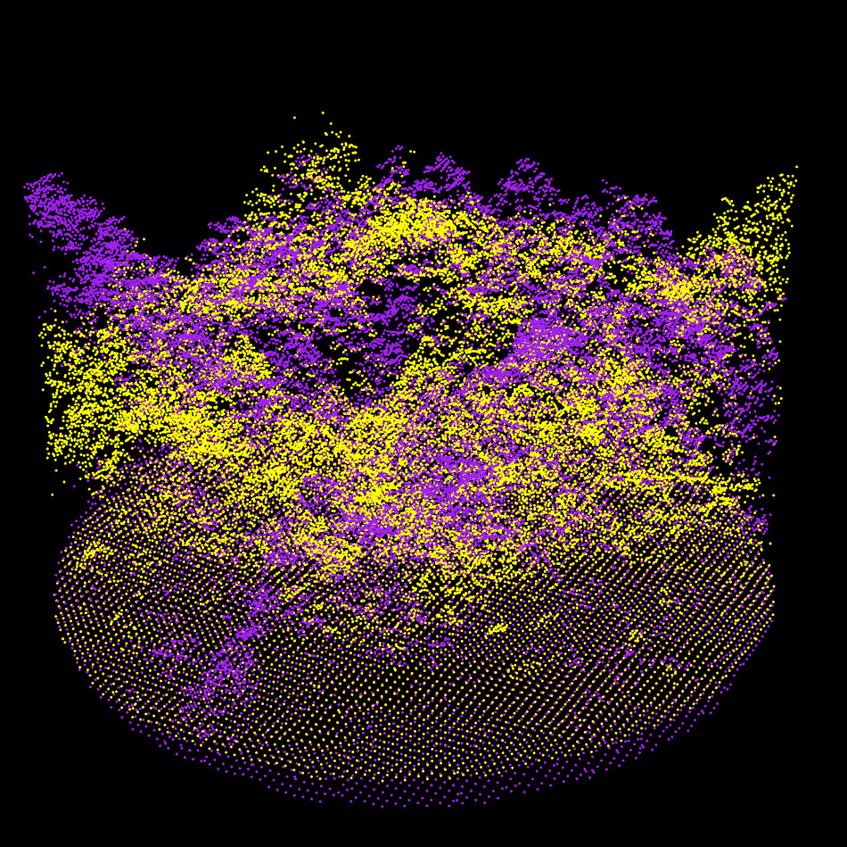
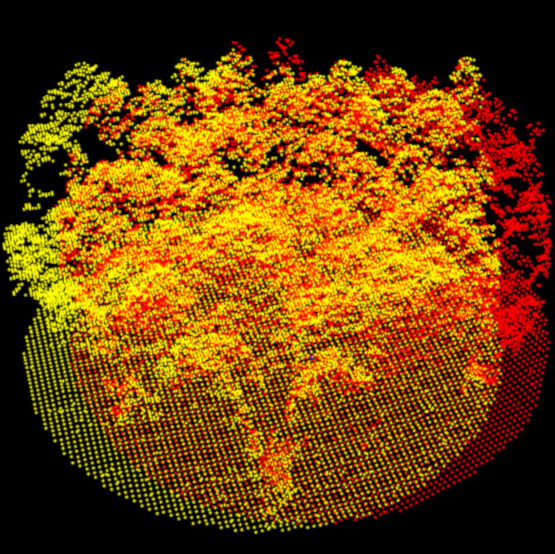
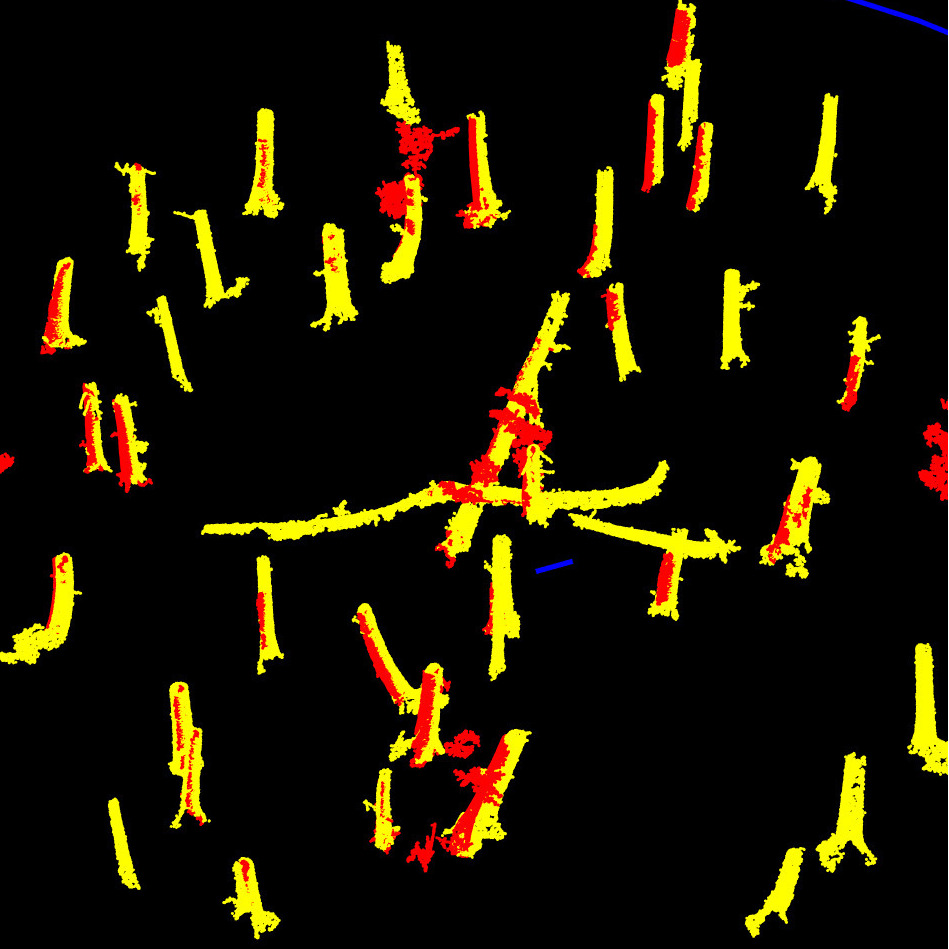

# lidRalignment


## Overview

`lidRalignment` enables automatic alignment of forest plot point clouds from different sources, such as ALS with TLS or MLS, or TLS with MLS, or ALS with ALS in a unified pipeline. The package is robust to large alignment differences (e.g., 180 degrees of misalignment), noise, and leaf-on/leaf-off conditions. A full description of the internal pipeline details is available [:book: here](https://r-lidar.github.io/lidRalignment/articles/internal.html).

  

## Features

- Aligns forest plots from any combination of ALS, ULS, TLS, and MLS point clouds
- Robust to large alignment differences (e.g., 180 degrees of misalignment)
- Supports noisy and poor-quality data
- Uses the same pipeline for all cases
- Fast and efficient: alignment takes only a few seconds. Most of the computation time is spent reading the LAS or LAZ files


## Installation

You need the latest version of `lidR` and `lasR`:  

```r
install.packages(c('lidR', 'lasR', 'lidRalignment'), repos = 'https://r-lidar.r-universe.dev')
```

## Tutorial

The alignment pipeline consists of four stages, progressing from raw to extra fine:

1. **Raw:** Roughly aligns the plot centers.
2. **Coarse**: Uses the DTM and CHM to align the point clouds at low resolution. This stage can handle highly misaligned scenes.
3. **Fine**: Applies an iterative closest point (ICP) approach to finely align the CHM and DTM.
4. **Extra Fine**: Used only when aligning two ground-based point clouds. It extracts trees and aligns them to achieve centimeter-level accuracy.

 A full description of the internal pipeline details is availailable [:book: here](https://r-lidar.github.io/lidRalignment/articles/internal.html).
 
```r
library(lidR)
library(lidRalignment)

fref = "als_file.las"
fmov = "mls_file.las"

# Setup the pipeline. It is important to tell the object
# what we are aligning in order to perform or not
# the last extra fine alignment
alignment = AlignmentScene$new(fref, fmov)
alignment$set_ref_is_ground_based(TRUE)
alignment$set_mov_is_ground_based(TRUE)

# Run the alignment pipeline
alignment$align()

# Visualize the different level of alignment
alignment$plot("raw")
alignment$plot("coarse")
alignment$plot("fine")
alignment$plot("extra", compare_to = "fine")

# Get the final transformation matrix to register the entire point cloud.
M = alignment$get_registration_matrix()

crs = sf::st_crs(readLASheader(fref))
ofile = transform_las(fmov, M, crs)
```

<details>
<summary>Rather than running the full alignment pipeline, it is possible to run it step by step (click to show).</summary>


```r
alignment = AlignmentScene$new(fref, fmov)
alignment$set_ref_is_ground_based(TRUE)
alignment$set_mov_is_ground_based(TRUE)

alignment$prepare()
alignment$plot("raw")

alignment$coarse_align()
alignment$plot("coarse")

alignment$fine_align()
alignment$plot("fine")

alignment$extra_fine_align()
alignment$plot("extra", compare_to = "fine")
```
</details>

## Sponsor

`lidRalignment` has been sponsored by the [University of Sherbrooke](https://www.usherbrooke.ca/)


