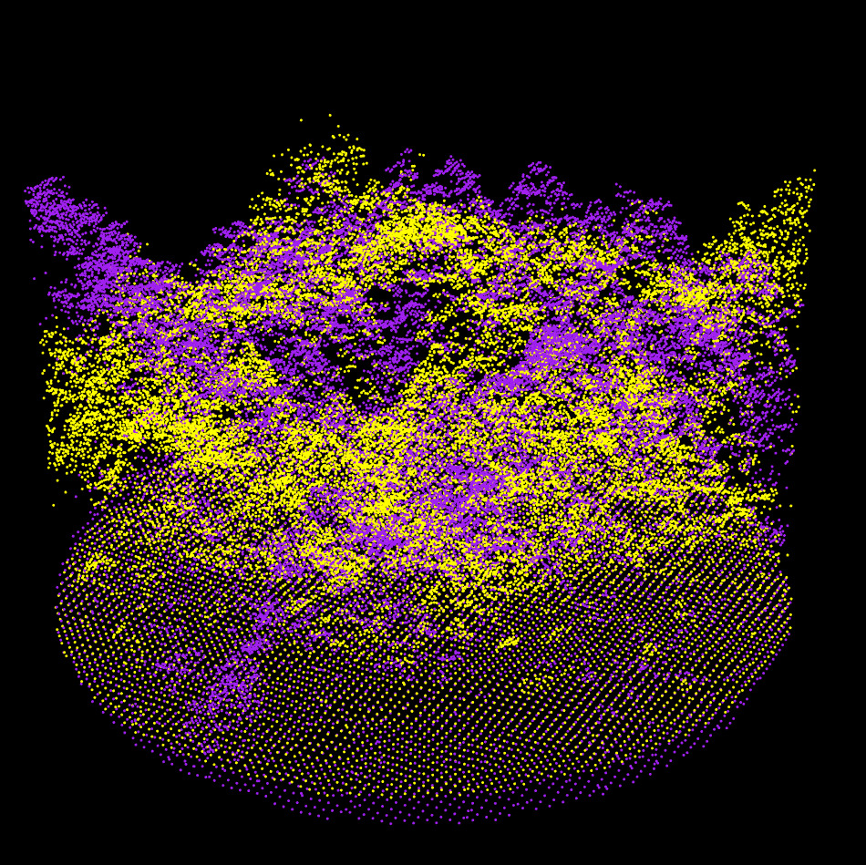
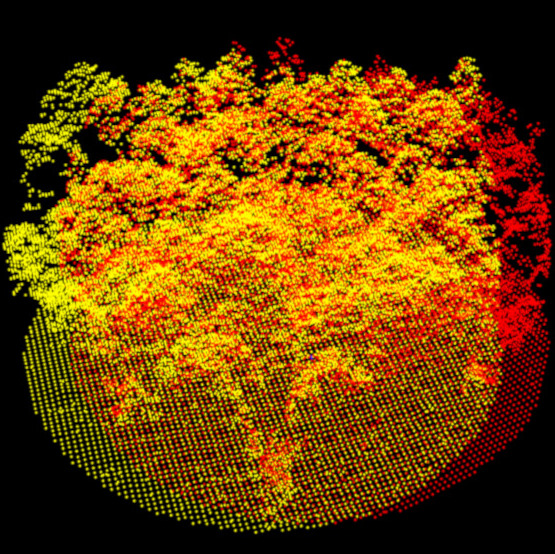
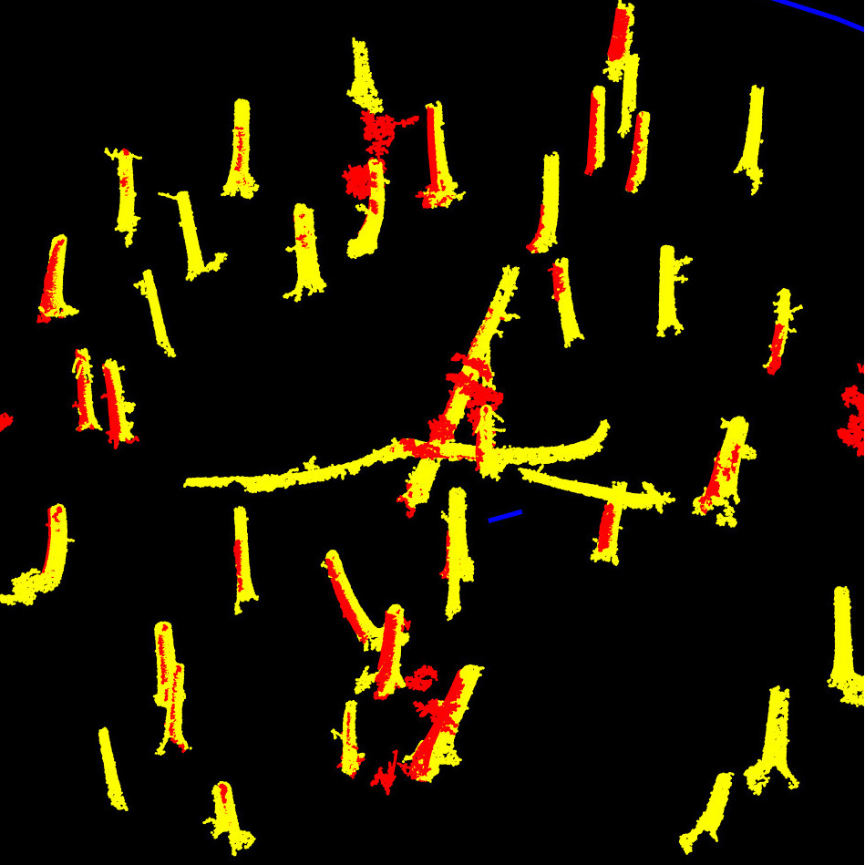

lidRalignment 
======================================================================================================


`lidRalignment` enables automatic alignment of forest **plot-scale** point clouds from different sources, such as ALS with TLS or MLS, TLS with MLS, or ALS with ALS, within a unified pipeline.

The package is robust to large alignment differences (e.g., up to 180 degrees of misalignment), noise, and leaf-on/leaf-off conditions, and it is **parameterless**. A full description of the internal pipeline is available [:book: here](https://r-lidar.github.io/lidRalignment/articles/internal.html).

  

## Features

- Aligns forest plots from any combination of ALS, ULS, TLS, and MLS point clouds
- Robust to large alignment differences (e.g., 180 degrees of misalignment)
- Supports noisy and poor-quality data
- Uses a single pipeline for all cases
- Fast and efficient: alignment takes only a few seconds; most of the computation time is spent reading the LAZ files
- No parameters required
- Tested on a large dataset (more than 100 plots)

## Installation

You need the latest versions of `lidR` and `lasR`:


```r
install.packages(c('lidR', 'lasR', 'lidRalignment'), repos = 'https://r-lidar.r-universe.dev')
```

## Tutorial

The alignment pipeline consists of four stages, progressing from raw to extra-fine:

1. **Raw:** Roughly aligns the plot centers.
2. **Coarse:** Uses the DTM and CHM to align the point clouds at low resolution. This stage can handle highly misaligned scenes.
3. **Fine:** Applies an Iterative Closest Point (ICP) approach to finely align the CHM and DTM.
4. **Extra Fine:** Used only when aligning two ground-based point clouds. It extracts trees and aligns them to achieve centimeter-level accuracy.

A full description of the internal pipeline is available [:book: here](https://r-lidar.github.io/lidRalignment/articles/internal.html).
 
<div style="background-color: #fff4e5; border-left: 5px solid #ff9800; padding: 12px 16px; color: #663c00;">
When aligning airborne data with ground-based data, the airborne point cloud should be used as the reference. The ground point cloud is the moving point cloud, because airborne data are usually better georeferenced.

When aligning ground-based data with ground-based data, it is recommended to use the better of the two point clouds as the reference, i.e., the one with less occlusion. Typically, the TLS point cloud is moved to align with the MLS reference.
</div>

 
```r
library(lidR)
library(lidRalignment)
options(lidR.progress = FALSE)

fref = "als_file.las"
fmov = "mls_file.las"

# Setup the pipeline. It is important to tell the object
# what we are aligning in order to perform or not
# the last extra fine alignment
alignment = AlignmentScene$new(fref, fmov)
alignment$set_ref_is_ground_based(FALSE)
alignment$set_mov_is_ground_based(TRUE)

# Run the alignment pipeline
alignment$align()

# Visualize the different level of alignment
alignment$plot("raw")
alignment$plot("coarse")
alignment$plot("fine")
alignment$plot("extra", compare_to = "fine")

# Get the final transformation matrix to register the entire point cloud.
M = alignment$get_registration_matrix()

crs = sf::st_crs(readLASheader(fref))
ofile = transform_las(fmov, M, crs)
```

<details>
<summary>Rather than running the full alignment pipeline, it is possible to run it step by step (click to show).</summary>


```r
alignment = AlignmentScene$new(fref, fmov)
alignment$set_ref_is_ground_based(FALSE)
alignment$set_mov_is_ground_based(TRUE)

alignment$prepare()
alignment$plot("raw")

alignment$coarse_align()
alignment$plot("coarse")

alignment$fine_align()
alignment$plot("fine")

alignment$extra_fine_align()
alignment$plot("extra", compare_to = "fine")
```
</details>

## Sponsor

`lidRalignment` has been sponsored by the [University of Sherbrooke](https://www.usherbrooke.ca/)


The development of the package was supported by data collected by Jonathan Boucher, Anne Cotton-Gagnon and Jean Marchal with method contribution by Bastien Vandendaele: Canadian Forest Service.


